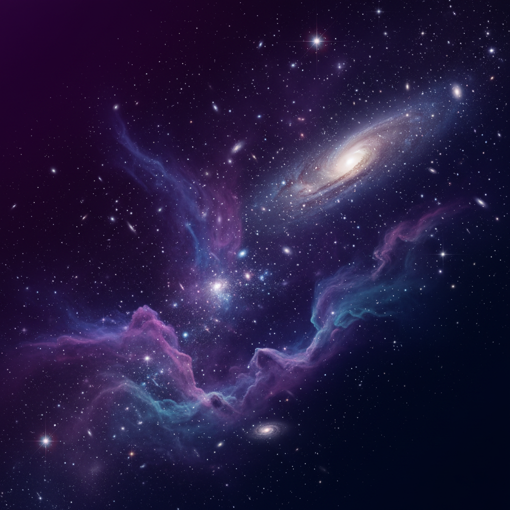

# 🌌 CosmoData - Explorando el Universo

Sitio web moderno sobre astronomía con funcionalidad e-commerce. Explora el cosmos, aprende sobre planetas, misiones espaciales y adquiere productos temáticos.



## ✨ Características

### 🚀 E-commerce Funcional
- **18 productos** organizados en 5 categorías (Telescopios, Libros, Posters, Ropa, Accesorios)
- **Carrito persistente** con localStorage
- **Filtros dinámicos** por categoría
- **Modales interactivos** para productos y carrito
- **Sistema de ratings** con estrellas

### 🎨 Diseño Modern
- Tema espacial oscuro con glassmorphism
- Gradientes vibrantes (morado, azul, rosa)
- Animaciones smooth con AOS y GSAP
- Responsive design completo
- Loading screen animado

### 📚 Contenido Educativo
- **8 Planetas** con datos científicos reales
- **4 Misiones Espaciales** actuales
- **4 Eventos Astronómicos** 2025-2026
- Información detallada y precisa

### 🔧 Librerías Modernas
- **AOS** (Animate On Scroll) - Animaciones al scroll
- **Swiper.js** - Carruseles touch-friendly
- **Particles.js** - Fondo animado de estrellas
- **GSAP + ScrollTrigger** - Animaciones profesionales
- **Font Awesome 6** - Iconografía moderna

## 📁 Estructura del Proyecto

```
CosmoData/
├── index.html              # Página principal
├── tienda.html             # E-commerce completo
├── css/
│   ├── style.css          # Estilos globales
│   └── pages.css          # Estilos e-commerce
├── js/
│   ├── script.js          # Lógica principal + librerías
│   ├── shop.js            # Sistema de carrito
│   └── data.js            # Base de datos (planetas, productos, etc.)
├── assets/
│   └── images/
│       ├── hero/          # Fondos de secciones hero
│       ├── planets/       # Imágenes de planetas
│       ├── products/      # Fotos de productos
│       └── events/        # Imágenes de eventos
└── README.md
```

## 🚀 Deploy en GitHub Pages

### Opción 1: GitHub UI (Más Fácil)

1. **Crear repositorio en GitHub**
   - Ir a https://github.com/new
   - Nombrar el repositorio (ej: `cosmodata`)
   - Marcar como "Public"
   - Click en "Create repository"

2. **Subir archivos**
   ```bash
   cd c:\Users\yooh2\OneDrive\Documentos\CosmoData
   git init
   git add .
   git commit -m "Initial commit - CosmoData website"
   git branch -M main
   git remote add origin https://github.com/TU-USUARIO/cosmodata.git
   git push -u origin main
   ```

3. **Activar GitHub Pages**
   - Ir a tu repositorio en GitHub
   - Click en "Settings"
   - Scroll hasta "Pages" en el menú lateral
   - En "Source", seleccionar "main" branch
   - Click en "Save"
   - ¡Listo! Tu sitio estará en: `https://TU-USUARIO.github.io/cosmodata/`

### Opción 2: GitHub CLI

```bash
# Instalar GitHub CLI si no lo tienes
# https://cli.github.com/

cd c:\Users\yooh2\OneDrive\Documentos\CosmoData
git init
git add .
git commit -m "Initial commit - CosmoData website"

# Crear repo y hacer push
gh repo create cosmodata --public --source=. --push

# Habilitar GitHub Pages
gh api repos/OWNER/cosmodata/pages -f source='{"branch":"main","path":"/"}'
```

## 💻 Desarrollo Local

```bash
# Opción 1: Python (ya está corriendo)
python -m http-server 8000

# Opción 2: Node.js
npx -y http-server -p 8080

# Opción 3: Live Server (VS Code Extension)
# Instalar extensión "Live Server" y hacer clic derecho > Open with Live Server
```

Abrir en navegador:
- http://localhost:8000 (index.html)
- http://localhost:8000/tienda.html (tienda)

## 🎯 Cómo Funciona el Carrito

1. **Agregar productos**: Click en "Agregar al Carrito" en cualquier producto
2. **Ver carrito**: Click en el icono del carrito (arriba derecha)
3. **Modificar cantidad**: Usar botones +/- en el modal del carrito
4. **Eliminar**: Click en icono de basura
5. **Persistencia**: El carrito se guarda automáticamente en localStorage

## 📦 Productos Disponibles

### Telescopios (3)
- Celestron AstroMaster 70AZ - $299.99
- Orion SkyQuest XT8 Classic - $449.99
- Meade Instruments Infinity 102 - $199.99

### Libros (4)
- Cosmos - Carl Sagan - $24.99
- Breve Historia del Tiempo - Hawking - $18.99
- Astrofísica para Gente con Prisas - Tyson - $16.99
- El Universo en Tu Mano - Galfard - $22.99

### Posters (5)
- Nebulosa del Águila - $19.99
- Sistema Solar Completo - $24.99
- Galaxia de Andrómeda - $19.99
- Nebulosa de Orión - $21.99
- Mapa Estelar Vintage - $29.99

### Ropa (3)
- Camiseta "Explora el Universo" - $29.99
- Sudadera "Astronauta Espacial" - $49.99
- Gorra NASA Vintage - $24.99

### Accesorios (3)
- Planisferio Rotativo - $34.99
- Linterna Roja Astronomía - $14.99
- Planisferio Fosforescente - $12.99

## 🌟 Características Técnicas

### Completamente Estático
- ✅ Sin backend requerido
- ✅ Todas las librerías desde CDN
- ✅ Rutas relativas
- ✅ localStorage para persistencia
- ✅ Compatible con GitHub Pages

### Performance
- Librerías optimizadas (minificadas)
- Lazy loading de imágenes
- CSS con variables personalizadas
- JavaScript modular

### SEO Friendly
- Meta tags completos
- Open Graph tags
- Semantic HTML5
- URLs amigables

## 🔧 Personalización

### Cambiar Colores
Editar variables CSS en `css/style.css`:
```css
:root {
    --color-primary: #7c3aed;     /* Morado principal */
    --color-secondary: #3b82f6;    /* Azul */
    --color-accent: #ec4899;       /* Rosa */
}
```

### Agregar Productos
Editar `js/data.js`:
```javascript
const products = [
    {
        id: 19,
        name: "Nuevo Producto",
        price: 99.99,
        category: "categoria",
        image: "assets/images/products/nuevo.jpg",
        rating: 4.5,
        reviews: 100,
        badge: "Nuevo",
        description: "Descripción del producto"
    }
];
```

### Cambiar Contenido
- **Planetas**: Editar `planetsData` en `js/data.js`
- **Misiones**: Editar `missionsData` en `js/data.js`
- **Eventos**: Editar `eventsData` en `js/data.js`

## 🐛 Solución de Problemas

### Las imágenes no cargan
- Verificar que las rutas sean relativas
- Asegurarse de que los archivos existan en `assets/images/`
- En GitHub Pages, esperar 1-2 minutos para propagación

### El carrito no funciona
- Verificar que JavaScript esté habilitado
- Comprobar consola del navegador (F12)
- Limpiar localStorage: `localStorage.clear()`

### Las animaciones no funcionan
- Verificar conexión a internet (librerías CDN)
- Comprobar que los scripts se carguen correctamente
- Ver consola para errores de JavaScript

## 📄 Licencia

Este proyecto es de código abierto y está disponible para uso educativo.

## 🤝 Contribuir

¿Quieres mejorar CosmoData? ¡Las contribuciones son bienvenidas!

1. Fork el repositorio
2. Crea una rama (`git checkout -b feature/mejora`)
3. Commit tus cambios (`git commit -m 'Agregar mejora'`)
4. Push a la rama (`git push origin feature/mejora`)
5. Abre un Pull Request

## 📧 Contacto

¿Preguntas? ¿Sugerencias? Abre un issue en GitHub.

---

**Desarrollado con ❤️ para explorar el universo** 🚀✨

**Stack**: HTML5, CSS3 (Vanilla), JavaScript (ES6+), AOS, Swiper.js, Particles.js, GSAP, Font Awesome
